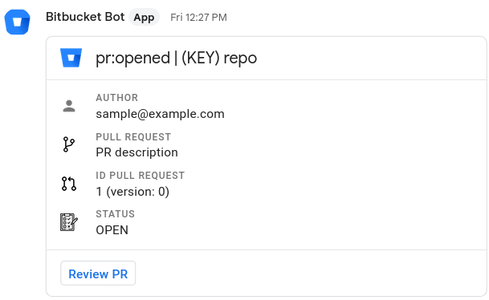

# Bitbucket Bot for Google Chat

## Introduction

Bitbucket Bot to integrate Bitbucket's webhook with Google Chat (Spaces).

## Example



## Image details (from dive)

```text
│ Image Details ├─────────────

Total Image size: 178 MB
Potential wasted space: 6.6 MB
Image efficiency score: 97 %
```

You can reproduce this summary with [`dive`](https://github.com/wagoodman/dive):

```command
dive build -t <tag-name> .
```

## Quick start!

### Pull image

```command
docker build -t <tag-name> .
```

### Run container

**IMPORTANT**: `--bind`, `--log-level`, `-e` are runtime Docker options.

```command
docker run --name <container-name>    \
  -p 8080:8080                        \
  <tag-name>                          \
  --bind 0.0.0.0:8080                 \
  --log-level=info                    \
  -e URL=<ENDPOINT-GOOGLE-CHAT-SPACE> \
  -e TOKEN=<SECRET-TOKEN>
```

* [Bitbucket playloads](https://confluence.atlassian.com/bitbucketserver0721/event-payload-1115665959.html?utm_campaign=in-app-help&utm_medium=in-app-help&utm_source=stash#Eventpayload-pullrequest)

## Contributing

We're happy if you want open and issue or a new feature :)
